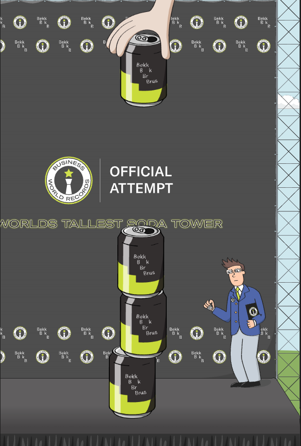

# JavaZone Spill

## Innholdsfortegnelse

- Informasjon
- Oppsett
- Scripts
- Innstillinger
- Fysiske komponenter
- Teknologier

## Informasjon

Dette repositoriet representerer JavaZone-spillet, som er forvaltet av Team Las-Vegas. Spillet ble utviklet for JavaZone 2024-standen, men kan også brukes på andre stands som Bekk har rundt omkring.

En demo av spillet er tilgjengelig på https://bekk.github.io/javazone-spill/

## Oppsett

Følg disse trinnene for å sette opp prosjektet:

1. Klon repositoriet ved å kjøre `git clone git@github.com:bekk/javazone-spill.git`
2. Naviger til repositoriet ved å kjøre `cd javazone-spill`
3. Installer avhengigheter ved å kjøre `npm install` (Dette trengs bare ved første oppstart eller når du legger til nye avhengigheter)
4. Start applikasjonen ved å kjøre `npm start`
5. Åpne nettleseren og gå til http://localhost:3000/

## Scripts

I dette prosjektet kan du kjøre følgende scripts:

- `npm start`: Kjører applikasjonen i utviklingsmodus
- `npm run build`: Bygger applikasjonen for produksjon
- `npm run preview`: For å teste bygget
- `npm run prettier`: Lar Prettier sjekke formateringen

## Innstillinger

Du finner innstillingene under `/admin`. Her kan du blant annet:

- Skru av/på lydeffekter 🔇
- Skru av/på Bluetooth-tilkobling til fysisk knapp 🛠️
- Skru av/på tidtaker (Lagrer poengscore og tid per spill) ⏱️
- Tilbakestille highscore-listen 🏆

## Fysiske komponenter

Det er implementert integrasjon mot en fysisk knapp.

## Teknologier

- React
- TypeScript
- Styled Components
- Matter.js
